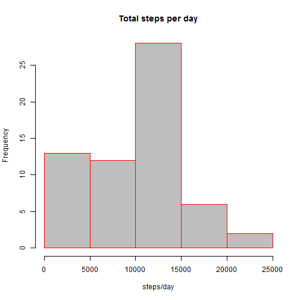
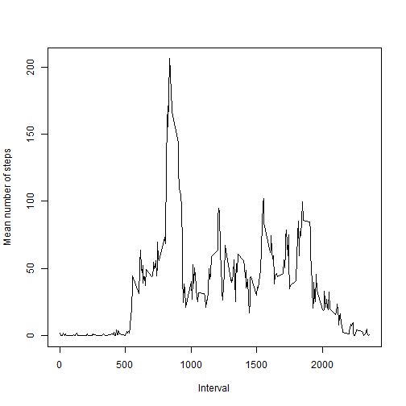
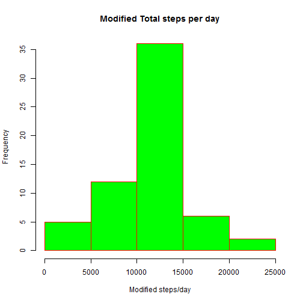

---
#Activity Monitoring Data
==================================================
#Introduction
It is now possible to collect a large amount of data about personal movement using activity monitoring devices such as a Fitbit, Nike Fuelband, or Jawbone Up. These type of devices are part of the "quantified self" movement - a group of enthusiasts who take measurements about themselves regularly to improve their health, to find patterns in their behavior, or because they are tech geeks. But these data remain under-utilized both because the raw data are hard to obtain and there is a lack of statistical methods and software for processing and interpreting the data.

This project makes use of data from a personal activity monitoring device. This device collects data at 5 minute intervals through out the day. The data consists of two months of data from an anonymous individual collected during the months of October and November, 2012 and include the number of steps taken in 5 minute intervals each day. We will carry out analysis of data and present the results.steps: Number of steps taking in a 5-minute interval (missing values are coded as NA)
date: The date on which the measurement was taken in YYYY-MM-DD format
interval: Identifier for the 5-minute interval in which measurement was taken
The dataset is stored in a comma-separated-value (CSV) file and there are a total of 17,568 observations in this dataset.


#Read data activity data from file 

```r
echo=TRUE
activity_data <- read.csv("activity.csv",stringsAsFactors = FALSE)
```

Date field is coerced as string so we need to convert it to date format


```r
activity_data$date <- as.Date(activity_data$date, "%Y-%m-%d")
summary(activity_data)
```

```
##      steps             date               interval     
##  Min.   :  0.00   Min.   :2012-10-01   Min.   :   0.0  
##  1st Qu.:  0.00   1st Qu.:2012-10-16   1st Qu.: 588.8  
##  Median :  0.00   Median :2012-10-31   Median :1177.5  
##  Mean   : 37.38   Mean   :2012-10-31   Mean   :1177.5  
##  3rd Qu.: 12.00   3rd Qu.:2012-11-15   3rd Qu.:1766.2  
##  Max.   :806.00   Max.   :2012-11-30   Max.   :2355.0  
##  NA's   :2304
```

Lets carry out some analysis
#What is mean total number of steps taken per day?

We will first group the data by Date. This essentially means that we calculate total number of steps taken each day.


```r
library(dplyr)
```

```
## 
## Attaching package: 'dplyr'
```

```
## The following objects are masked from 'package:stats':
## 
##     filter, lag
```

```
## The following objects are masked from 'package:base':
## 
##     intersect, setdiff, setequal, union
```

```r
library(ggplot2)
sumdata <- tapply(activity_data$steps,activity_data$date,FUN = sum,na.rm=TRUE)
sumdata
```

```
## 2012-10-01 2012-10-02 2012-10-03 2012-10-04 2012-10-05 2012-10-06 
##          0        126      11352      12116      13294      15420 
## 2012-10-07 2012-10-08 2012-10-09 2012-10-10 2012-10-11 2012-10-12 
##      11015          0      12811       9900      10304      17382 
## 2012-10-13 2012-10-14 2012-10-15 2012-10-16 2012-10-17 2012-10-18 
##      12426      15098      10139      15084      13452      10056 
## 2012-10-19 2012-10-20 2012-10-21 2012-10-22 2012-10-23 2012-10-24 
##      11829      10395       8821      13460       8918       8355 
## 2012-10-25 2012-10-26 2012-10-27 2012-10-28 2012-10-29 2012-10-30 
##       2492       6778      10119      11458       5018       9819 
## 2012-10-31 2012-11-01 2012-11-02 2012-11-03 2012-11-04 2012-11-05 
##      15414          0      10600      10571          0      10439 
## 2012-11-06 2012-11-07 2012-11-08 2012-11-09 2012-11-10 2012-11-11 
##       8334      12883       3219          0          0      12608 
## 2012-11-12 2012-11-13 2012-11-14 2012-11-15 2012-11-16 2012-11-17 
##      10765       7336          0         41       5441      14339 
## 2012-11-18 2012-11-19 2012-11-20 2012-11-21 2012-11-22 2012-11-23 
##      15110       8841       4472      12787      20427      21194 
## 2012-11-24 2012-11-25 2012-11-26 2012-11-27 2012-11-28 2012-11-29 
##      14478      11834      11162      13646      10183       7047 
## 2012-11-30 
##          0
```

```r
mean_of_sum <- round(mean(sumdata))
median_of_sum <- round(median(sumdata))

print(c("mean of the data is", mean_of_sum))
```

```
## [1] "mean of the data is" "9354"
```

```r
print(c("median of the data is",median_of_sum))
```

```
## [1] "median of the data is" "10395"
```


##Let us draw a histogram of the total number of steps each day


```r
hist(sumdata,xlab = "steps/day", main = "Total steps per day",col="gray",border="red")
```



#What is the average daily activity pattern?


```r
mean_interval <- tapply(activity_data$steps, activity_data$interval, mean, na.rm=T)
plot(mean_interval ~ unique(activity_data$interval), type="l", xlab = "Interval",ylab = "Mean number of steps")
```




##Let us find out interval where the value of mean number of steps is maximum


```r
mean_interval[which.max(mean_interval)]
```

```
##      835 
## 206.1698
```


#Inputting missing values
There are a number of days/intervals where there are missing values (coded as NA). The presence of missing days may introduce bias into some calculations or summaries of the data. We will now determine how many values are missing and what is the impact on calcualtions.

Calculate and report the total number of missing values in the dataset (i.e. the total number of rows with NAs)


```r
sum(is.na(activity_data$steps))
```

```
## [1] 2304
```

```r
mean(is.na(activity_data$steps))
```

```
## [1] 0.1311475
```

There are a total of 2304 rows where the values are missing and threfore are marked as "NA". This corresponds to a total 13% of the total. 

The best strategy to fill the missing value is to use mean value of the coresponding step. We will create a new dataset with "NA"" values for steps replaced with mean value for the interval in which the NA is encountered. 


```r
mod_activity_data <- activity_data # initialise the new data set with existing data set 
for (i in 1:nrow(activity_data)){
    if(is.na(activity_data$steps[i])){
        mod_activity_data$steps[i]<- mean_interval[[as.character(activity_data[i, "interval"])]]
    }
}
```

##Ensure there are no NA values now


```r
sum(is.na(mod_activity_data$steps))
```

```
## [1] 0
```

Now we can calculate the sum of the steps for each data and plot histogram again with modified dataset.


```r
mod_sumdata <- tapply(mod_activity_data$steps,mod_activity_data$date,FUN = sum,na.rm=TRUE)
mod_mean_of_sum <- round(mean(mod_sumdata))
mod_median_of_sum <- round(median(mod_sumdata))
```

##Let us see what is the new mean and median


```r
print(c("mean of the modified data is", mod_mean_of_sum))
```

```
## [1] "mean of the modified data is" "10766"
```

```r
print(c("mod_median of the modified data is",mod_median_of_sum))
```

```
## [1] "mod_median of the modified data is"
## [2] "10766"
```


##Plot a new Histogram


```r
hist(mod_sumdata,xlab = "Modified steps/day", main = "Modified Total steps per day",col="green",border="red")
```



#Are there differences in activity patterns between weekdays and weekends?
First, we will add a new column to the modified dataset to store if the day falls on a weekday or weekends


```r
mod_activity_data$day <- ifelse(weekdays(mod_activity_data$date) %in% c("Saturday", "Sunday"), "weekend", "weekday")
head(mod_activity_data)
```

```
##       steps       date interval     day
## 1 1.7169811 2012-10-01        0 weekday
## 2 0.3396226 2012-10-01        5 weekday
## 3 0.1320755 2012-10-01       10 weekday
## 4 0.1509434 2012-10-01       15 weekday
## 5 0.0754717 2012-10-01       20 weekday
## 6 2.0943396 2012-10-01       25 weekday
```

```r
tail(mod_activity_data)
```

```
##           steps       date interval     day
## 17563 2.6037736 2012-11-30     2330 weekday
## 17564 4.6981132 2012-11-30     2335 weekday
## 17565 3.3018868 2012-11-30     2340 weekday
## 17566 0.6415094 2012-11-30     2345 weekday
## 17567 0.2264151 2012-11-30     2350 weekday
## 17568 1.0754717 2012-11-30     2355 weekday
```

Seperate weekend and weekday data and plot a graph showing activity patterns over weekdays and weekends


```r
weekend_data <- subset(mod_activity_data,mod_activity_data$day == "weekend")
weekday_data <- subset(mod_activity_data,mod_activity_data$day == "weekday")
                          
mean_weekend <- tapply(weekend_data$steps, weekend_data$interval, mean)
mean_weekday <- tapply(weekday_data$steps, weekday_data$interval, mean)

avg_weekday <- data.frame(interval = unique(weekday_data$interval), avg = as.numeric(mean_weekday), day = rep("weekday", length(mean_weekday)))

avg_weekend <- data.frame(interval = unique(weekend_data$interval), avg = as.numeric(mean_weekend), day = rep("weekend", length(mean_weekend)))

combinddata <- rbind(avg_weekday,avg_weekend)
library(lattice)
xyplot(avg ~ interval | day, data = combinddata, layout = c(1, 2), 
       type = "l", xlab= "Interval", ylab = "Number of steps")
```


The pattern of activity is similair over weekend and weekdays but the level of activity (number of average steps) over weekens is higher as compared to that over weekdays
